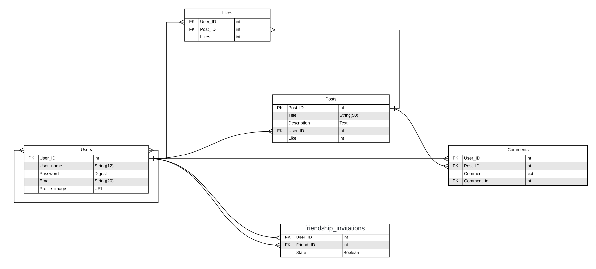

# Scaffold for social media app with Ruby on Rails

> This repo includes intial code for social media app with basic styling. Its purpose is to be a starting point for Microverse students.

## Diagram for the App




## Live Demo

TBA


## Getting Started

To get a local copy up and running follow these simple example steps.

### Prerequisites

Ruby: 2.7.0
Rails: 5.2.3
Postgres: >=9.5

## 📝 Setup

1. Open the terminal.
2. On the terminal navigate to the project directory using `cd ror-social-scaffold /`.
3. Install dependencies using: `bundle install`.
3. If it required: `bundle update`.
4. Migrate the database: `rails db:migrate`.
5. If required run: `yarn install`, and repeate the step 4.
6. Start the application : `rails server`.
7. To Stop the application : Create a user.

Setup database with:

```
   rails db:create
   rails db:migrate
```

### Github Actions

To make sure the linters' checks using Github Actions work properly, you should follow the next steps:

1. On your recently forked repo, enable the GitHub Actions in the Actions tab.
2. Create the `feature/branch` and push.
3. Start working on your milestone as usual.
4. Open a PR from the `feature/branch` when your work is done.


### Usage

Start server with:

```
    rails server
```

Open `http://localhost:3000/` in your browser.

### Run tests

```
    rpsec --format documentation
```

> Tests will be added by Microverse students. There are no tests for initial features in order to make sure that students write all tests from scratch.

### Deployment

TBA

## Authors

👤 **Kender Bolivar**

- GitHub: [@kenderb](https://github.com/ken)
- Twitter: [@twitterhandle](https://twitter.com/KBTarts )
- LinkedIn: [KenderBolivar](https://www.linkedin.com/in/kender-bolivar-1736086b/ )


👤 **Kenvin Cotrina**

- GitHub: [kcotrinam](https://github.com/kcotrinam) 
- Twitter: [@kcotrinam_dev](https://twitter.com/kcotrinam_dev)
- LinkedIn: [KevinCotrina](https://www.linkedin.com/in/kevincotrina/ )

## 🤝 Contributing

Contributions, issues and feature requests are welcome!

Feel free to check the [issues page](issues/).

## Show your support

Give a ⭐️ if you like this project!

## :grey_exclamation: Acknowledgments

- [Rails Guides](https://guides.rubyonrails.org/)
- [Shoulda Matchers](https://matchers.shoulda.io/docs/v4.4.1/index.html)
- Stack Overflow
- Odin Project.

## 📝 License

TBA