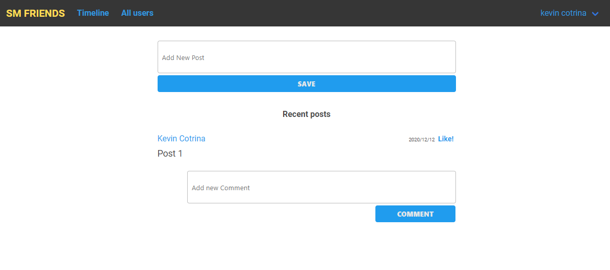
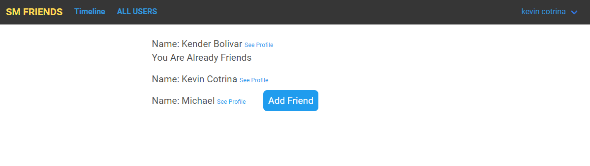

# Social media app with Ruby on Rails

> This Project is based on a social network. It is focused on send friend requests to other users. The app also allows the user to see his own posts and see the urser's friends posts.

## Diagram for the App

## Demo Screenshots

## Live Demo

[Live version](https://sm-friends.herokuapp.com/users)

## Prerequisites

Ruby: 2.7.0
Rails: 5.2.3
Postgres: >=9.5

## Getting Started

To get a local copy up and running follow these simple example steps.

## 📝 Setup

1. Open the terminal.
2. On the terminal navigate to the project directory using `cd ror-social-scaffold /`.
3. Install dependencies using: `bundle install`.
3. If it required: `bundle update`.
4. Migrate the database: `rails db:migrate`.
5. If required run: `yarn install`, and repeate the step 4.
6. Run rails `db:create`
7. rails `db:migrate`
8. Start the application : `rails server`.
9. Open `http://localhost:3000/` in your browser.
10. To Stop the application : Create a user.

## Run tests

- Open the terminal
- Run `rpsec --format documentation`

## Authors

👤 **Kender Bolivar**

- GitHub: [@kenderb](https://github.com/ken)
- Twitter: [@twitterhandle](https://twitter.com/KBTarts )
- LinkedIn: [KenderBolivar](https://www.linkedin.com/in/kender-bolivar-1736086b/ )

👤 **Kenvin Cotrina**

- GitHub: [kcotrinam](https://github.com/kcotrinam) 
- Twitter: [@kcotrinam_dev](https://twitter.com/kcotrinam_dev)
- LinkedIn: [KevinCotrina](https://www.linkedin.com/in/kevincotrina/ )

## 🤝 Contributing

Contributions, issues and feature requests are welcome!

Feel free to check the [issues page](issues/).

## Show your support

Give a ⭐️ if you like this project!

## :grey_exclamation: Acknowledgments

- [Rails Guides](https://guides.rubyonrails.org/)
- [Shoulda Matchers](https://matchers.shoulda.io/docs/v4.4.1/index.html)
- Stack Overflow
- Odin Project.

## 📝 License

TBA